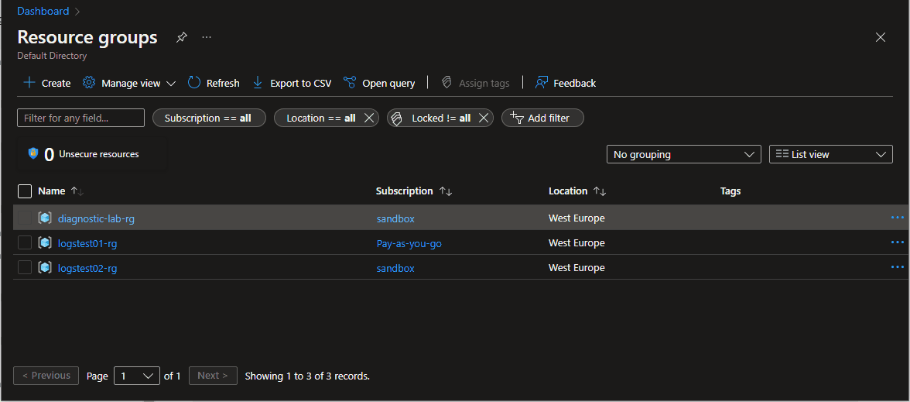

# az-activity-log-and-graph


## 1. Przygotowanie środowiska
```bash
SUB_01="616bb79e-73be-40ca-bea5-219c413d4771"
SUB_02="748173f1-20c4-4e68-ac58-641f67a83501"
DIAGNOSTIC_RG="diagnostic-lab-rg"
LOGSTEST01_RG="logstest01-rg"
LOGSTEST02_RG="logstest02-rg"
LOCATION="westeurope"

az group create --name $DIAGNOSTIC_RG --location $LOCATION --subscription $SUB_02
az group create --name $LOGSTEST01_RG --location $LOCATION --subscription $SUB_01
az group create --name $LOGSTEST02_RG --location $LOCATION --subscription $SUB_02

az monitor log-analytics workspace create --resource-group $DIAGNOSTIC_RG --workspace-name "diagnosticlogs-la" --location $LOCATION --subscription $SUB_02
```

## 2. Wysyłanie logów z Activity log do Log Analytics
* https://docs.microsoft.com/en-us/azure/azure-monitor/essentials/activity-log#send-to-log-analytics-workspace

### 2.1 



```bash
az group delete --name $DIAGNOSTIC_RG --location $LOCATION --subscription $SUB_02
az group delete --name $LOGSTEST01_RG --location $LOCATION --subscription $SUB_01
az group delete --name $LOGSTEST02_RG --location $LOCATION --subscription $SUB_02

```


```bash

az network public-ip create \
    --resource-group $RGROUP \
    --name test-pip \
    --version IPv4 \
    --sku Basic \
    --allocation-method Dynamic

az storage blob list --account-name "diagnosticdemobp" --container-name "insights-activity-logs"
az storage blob list --account-name "diagnosticdemobpallsa" --container-name "insights-activity-logs"
```