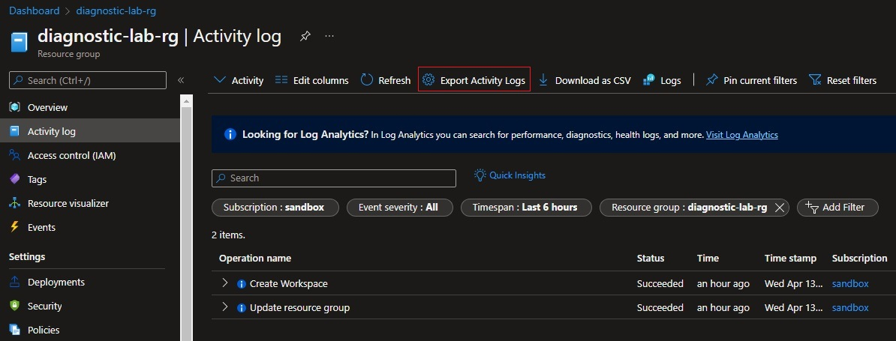
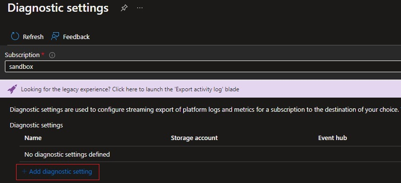
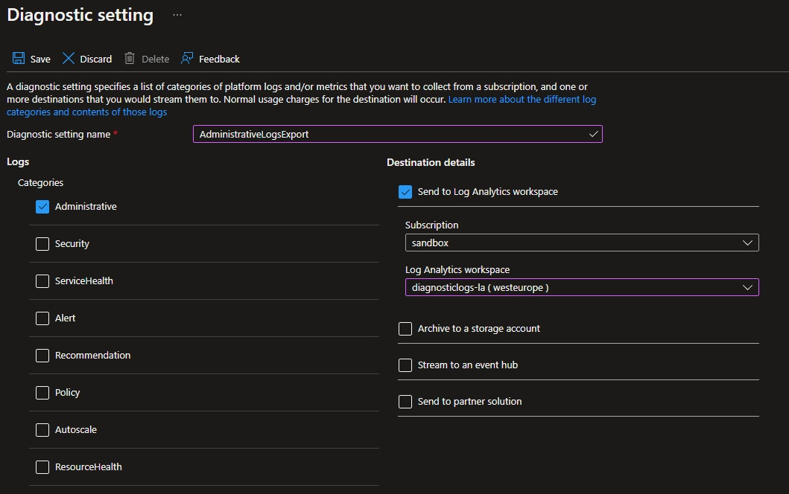
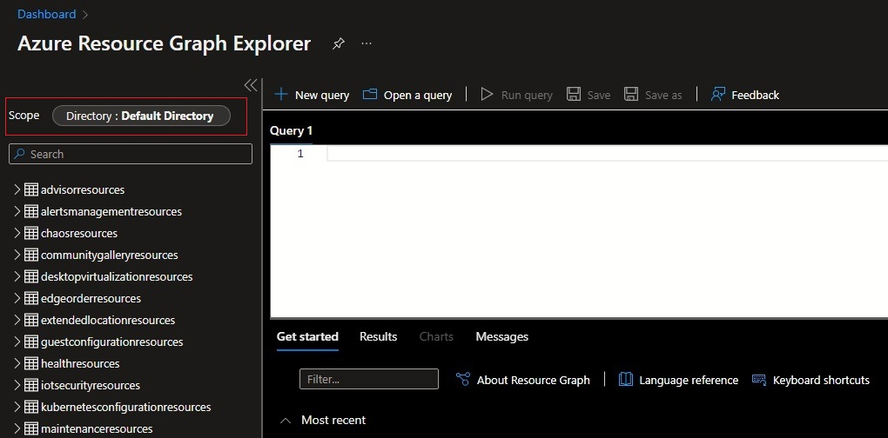
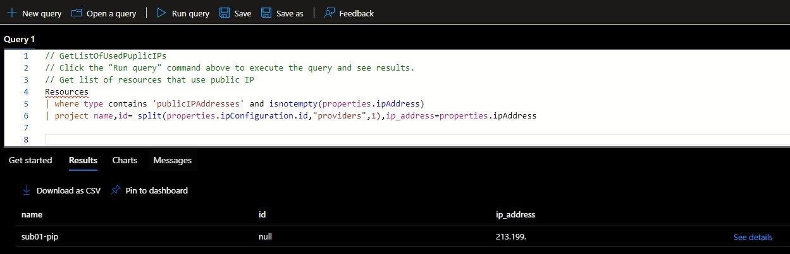
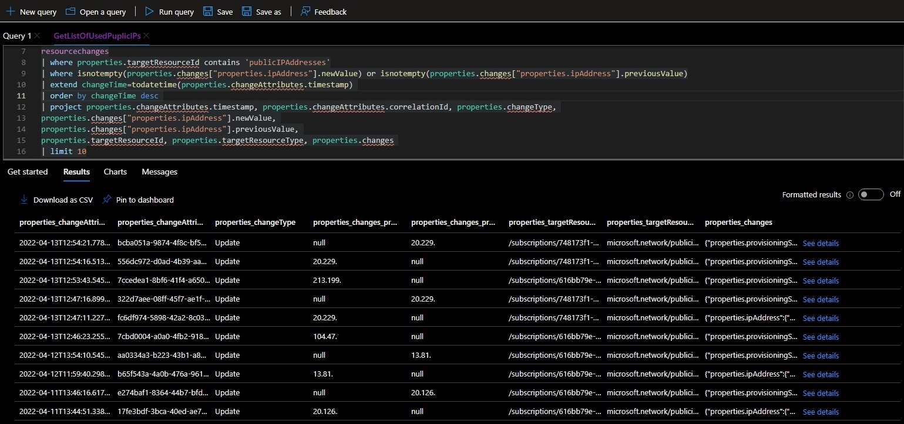
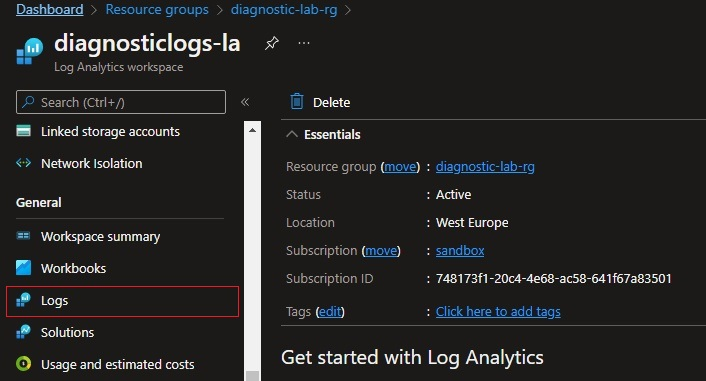
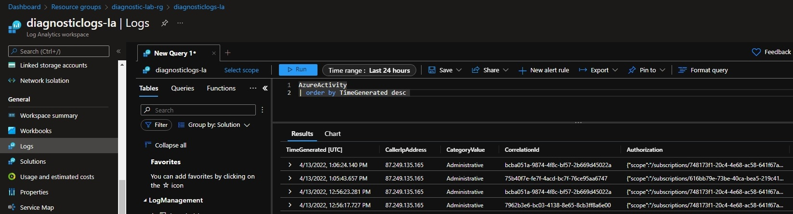

# Azure Log Analytics and Azure Graph Lab


### 1. Przygotowanie środowiska
```bash
SUB_01="616bb79e-73be-40ca-bea5-219c413d4771"
SUB_02="748173f1-20c4-4e68-ac58-641f67a83501"
DIAGNOSTIC_RG="lab-diagnostic-rg"
LOGSTEST01_RG="lab-logstest01-rg"
LOGSTEST02_RG="lab-logstest02-rg"
LOCATION="westeurope"

az group create --name $DIAGNOSTIC_RG --location $LOCATION --subscription $SUB_02
az group create --name $LOGSTEST01_RG --location $LOCATION --subscription $SUB_01
az group create --name $LOGSTEST02_RG --location $LOCATION --subscription $SUB_02

az monitor log-analytics workspace create --resource-group $DIAGNOSTIC_RG --workspace-name "lab-diagnosticlogs-la" --location $LOCATION --subscription $SUB_02
```

### 2. Wysyłanie logów z Activity log do Log Analytics
Dokumentacja:
* [Send to Log Analytics workspace](https://docs.microsoft.com/en-us/azure/azure-monitor/essentials/activity-log#send-to-log-analytics-workspace)

#### 2.1 Przechodzimy do `Activity log` -> `Export Activity Logs`



#### 2.2 Wybieramy subskrypcję i przechodzimy do `Add diagnostic setting`



#### 2.3 Zaznaczamy logi administracyjne oraz Log Analytics workspace i zapisujemy ustawienia
* [Kategorie logów - opis](https://docs.microsoft.com/en-us/azure/azure-monitor/essentials/activity-log-schema?WT.mc_id=Portal-Microsoft_Azure_Monitoring#categories)



#### 2.4 Powyższe kroki powtarzamy dla każdej subskrypcji


### 3. Wygenerowanie przykładowych logów
```bash
# Utworzenie publicznych IP
az network public-ip create \
    --resource-group $LOGSTEST01_RG \
    --subscription $SUB_01 \
    --name sub01-pip \
    --version IPv4 \
    --sku Basic \
    --allocation-method Static

az network public-ip create \
    --resource-group $LOGSTEST02_RG \
    --subscription $SUB_02 \
    --name sub02-pip \
    --version IPv4 \
    --sku Basic \
    --allocation-method Dynamic

# Wygenerowanie zmian na IP
az network public-ip update \
    --resource-group $LOGSTEST02_RG \
    --subscription $SUB_02 \
    --name sub02-pip \
    --allocation-method Static

az network public-ip update \
    --resource-group $LOGSTEST02_RG \
    --subscription $SUB_02 \
    --name sub02-pip \
    --allocation-method Dynamic
```

### 4. Wykorzystanie `Resource Graph`

Dokumentacja:
* [What is Azure Resource Graph?](https://docs.microsoft.com/en-us/azure/governance/resource-graph/overview)
* [Quickstart: Run your first Resource Graph query using REST API](https://docs.microsoft.com/en-us/azure/governance/resource-graph/first-query-rest-api)

#### 4.1 Przechodzimy do usługi `Resource Graph Explorer`


#### 4.2 Sprawdzamy czy ustawiony jest poprawny scope
Wybor `Scope` jako `Directory` pozwoli odpytywać o zasoby ze wszystkich dostępnych subskrypcji


#### 4.3 Przykładowe zapytania o zasoby
* Lista zasobów `Public IP address`, które mają dostępny adres publiczny:
  ```kql
  Resources
  | where type contains 'publicIPAddresses' and isnotempty(properties.ipAddress)
  | project name,id= split(properties.ipConfiguration.id,"providers",1),ip_address=properties.ipAddress
  ```
  
* Lista ostatnich 10 zmian adresów IP na zasobie `Public IP address`:
  ```kql
  resourcechanges
  | where properties.targetResourceId contains 'publicIPAddresses'
  | where isnotempty(properties.changes["properties.ipAddress"].newValue) or isnotempty(properties.changes["properties.ipAddress"].previousValue)
  | extend changeTime=todatetime(properties.changeAttributes.timestamp) 
  | order by changeTime desc 
  | project properties.changeAttributes.timestamp, properties.changeAttributes.correlationId, properties.changeType, 
  properties.changes["properties.ipAddress"].newValue, 
  properties.changes["properties.ipAddress"].previousValue, 
  properties.targetResourceId, properties.targetResourceType, properties.changes 
  | limit 10
  ```
  


### 5. Wykorzystanie `Log Analytics`
`Resource Graph` nie posiada informacji o autorze zmian, informacje te natomiast można pobrać z `Activity log`, które exportujemy do `Log Analytics` w celu łatwiejszego odpytywania.


#### 5.1 Przechodzimy do zasobu `diagnosticlogs-la` i w sekcji `General` Wybieramy `Logs`



#### 5.2 Przykładowe zapytanie
* Lista ostanich zmian:
  ```kql
  AzureActivity
  | order by TimeGenerated desc 
  ```
  


<!-- 


<details>
  <summary><b><i>Utworzone środowisko</i></b></summary>


</details>

```bash
az group delete --name $DIAGNOSTIC_RG --location $LOCATION --subscription $SUB_02
az group delete --name $LOGSTEST01_RG --location $LOCATION --subscription $SUB_01
az group delete --name $LOGSTEST02_RG --location $LOCATION --subscription $SUB_02

```


```bash

az network public-ip create \
    --resource-group $RGROUP \
    --name test-pip \
    --version IPv4 \
    --sku Basic \
    --allocation-method Dynamic

az storage blob list --account-name "diagnosticdemobp" --container-name "insights-activity-logs"
az storage blob list --account-name "diagnosticdemobpallsa" --container-name "insights-activity-logs"
``` -->