# Azure Log Analytics and Azure Graph Lab


### 1. Przygotowanie środowiska
```bash
SUB_01="616bb79e-73be-40ca-bea5-219c413d4771"
SUB_02="748173f1-20c4-4e68-ac58-641f67a83501"
DIAGNOSTIC_RG="lab-diagnostic-rg"
LOGSTEST01_RG="lab-logstest01-rg"
LOGSTEST02_RG="lab-logstest02-rg"
LOCATION="westeurope"

az group create --name $DIAGNOSTIC_RG --location $LOCATION --subscription $SUB_02
az group create --name $LOGSTEST01_RG --location $LOCATION --subscription $SUB_01
az group create --name $LOGSTEST02_RG --location $LOCATION --subscription $SUB_02

az monitor log-analytics workspace create --resource-group $DIAGNOSTIC_RG --workspace-name "lab-diagnosticlogs-la" --location $LOCATION --subscription $SUB_02
```


### 2. Wysyłanie logów z Activity log do Log Analytics
Dokumentacja:
* [Send to Log Analytics workspace](https://docs.microsoft.com/en-us/azure/azure-monitor/essentials/activity-log#send-to-log-analytics-workspace)

<details>
  <summary><b><i>Instrukcja</i></b></summary>

#### 2.1 Przechodzimy do `Activity log` -> `Export Activity Logs`
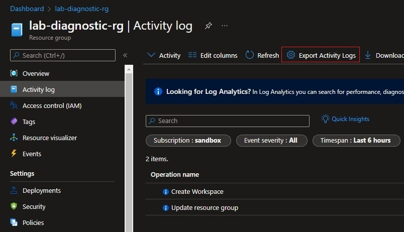


#### 2.2 Wybieramy subskrypcję i przechodzimy do `Add diagnostic setting`
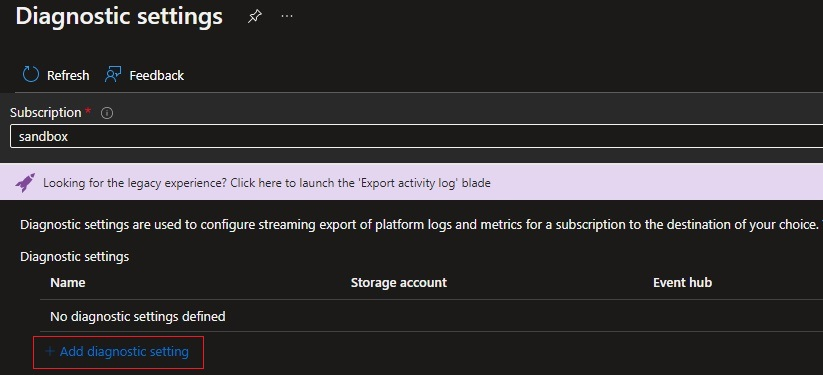


#### 2.3 Zaznaczamy logi administracyjne oraz Log Analytics workspace i zapisujemy ustawienia
* [Kategorie logów - opis](https://docs.microsoft.com/en-us/azure/azure-monitor/essentials/activity-log-schema?WT.mc_id=Portal-Microsoft_Azure_Monitoring#categories)

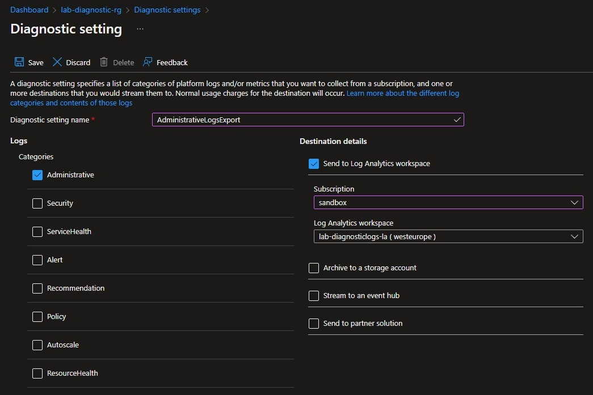

#### 2.4 Powyższe kroki powtarzamy dla każdej subskrypcji
</details>

### 3. Wygenerowanie przykładowych logów
```bash
# Utworzenie publicznych IP
az network public-ip create \
    --resource-group $LOGSTEST01_RG \
    --subscription $SUB_01 \
    --name sub01-pip \
    --version IPv4 \
    --sku Basic \
    --allocation-method Static

az network public-ip create \
    --resource-group $LOGSTEST02_RG \
    --subscription $SUB_02 \
    --name sub02-pip \
    --version IPv4 \
    --sku Basic \
    --allocation-method Dynamic

# Wygenerowanie zmian na IP
az network public-ip update \
    --resource-group $LOGSTEST02_RG \
    --subscription $SUB_02 \
    --name sub02-pip \
    --allocation-method Static

az network public-ip update \
    --resource-group $LOGSTEST02_RG \
    --subscription $SUB_02 \
    --name sub02-pip \
    --allocation-method Dynamic
```

### 4. Wykorzystanie `Resource Graph`

Dokumentacja:
* [What is Azure Resource Graph?](https://docs.microsoft.com/en-us/azure/governance/resource-graph/overview)
* [Quickstart: Run your first Resource Graph query using REST API](https://docs.microsoft.com/en-us/azure/governance/resource-graph/first-query-rest-api)

<details>
  <summary><b><i>Instrukcja</i></b></summary>

#### 4.1 Przechodzimy do usługi `Resource Graph Explorer`
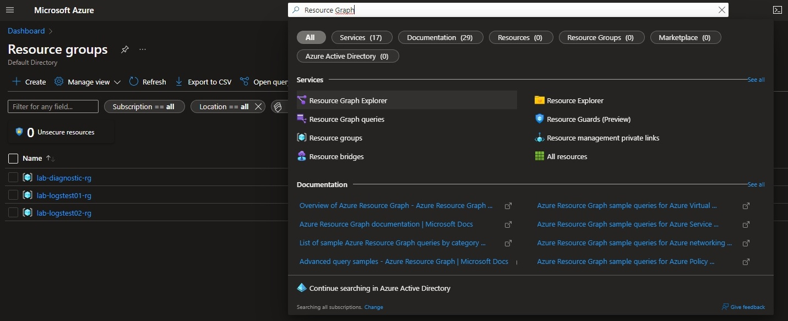

#### 4.2 Sprawdzamy czy ustawiony jest poprawny scope
Wybor `Scope` jako `Directory` pozwoli odpytywać o zasoby ze wszystkich dostępnych subskrypcji

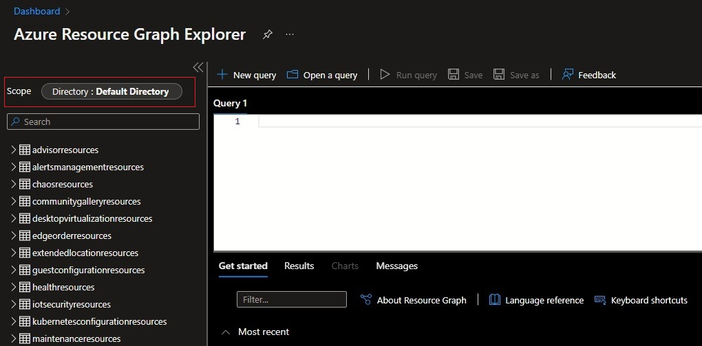

#### 4.3 Przykładowe zapytania o zasoby
* Lista zasobów `Public IP address`, które mają dostępny adres publiczny:
  ```kql
  Resources
  | where type contains 'publicIPAddresses' and isnotempty(properties.ipAddress)
  | project name,id= split(properties.ipConfiguration.id,"providers",1),ip_address=properties.ipAddress
  ```
  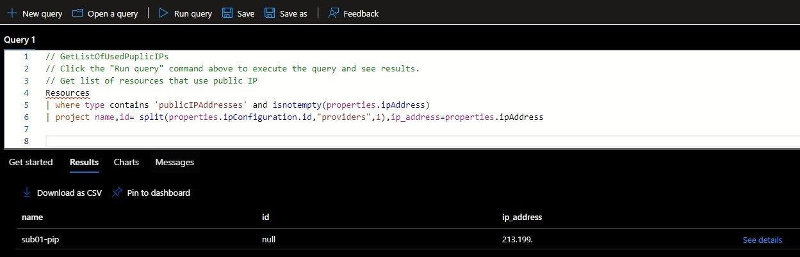
* Lista ostatnich 10 zmian adresów IP na zasobie `Public IP address`:
  ```kql
  resourcechanges
  | where properties.targetResourceId contains 'publicIPAddresses'
  | where isnotempty(properties.changes["properties.ipAddress"].newValue) or isnotempty(properties.changes["properties.ipAddress"].previousValue)
  | extend changeTime=todatetime(properties.changeAttributes.timestamp) 
  | order by changeTime desc 
  | project properties.changeAttributes.timestamp, properties.changeAttributes.correlationId, properties.changeType, 
  properties.changes["properties.ipAddress"].newValue, 
  properties.changes["properties.ipAddress"].previousValue, 
  properties.targetResourceId, properties.targetResourceType, properties.changes 
  | limit 10
  ```
  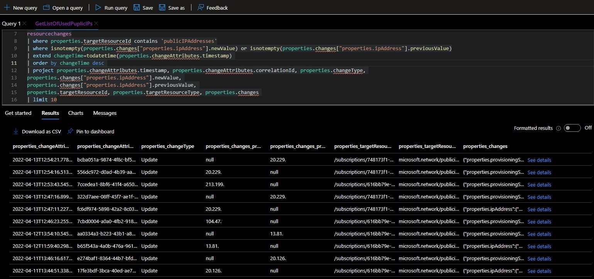

</details>

### 5. Wykorzystanie `Log Analytics`
`Resource Graph` nie posiada informacji o autorze zmian, informacje te natomiast można pobrać z `Activity log`, które exportujemy do `Log Analytics` w celu łatwiejszego odpytywania.


#### 5.1 Przechodzimy do zasobu `lab-diagnosticlogs-la` i w sekcji `General` Wybieramy `Logs`
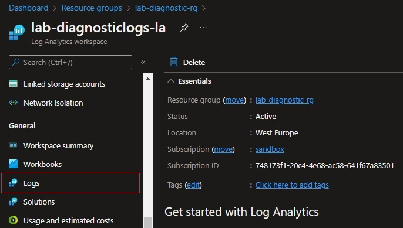


#### 5.2 Przykładowe zapytanie
* Lista ostanich zmian:
  ```kql
  AzureActivity
  | order by TimeGenerated desc 
  ```
  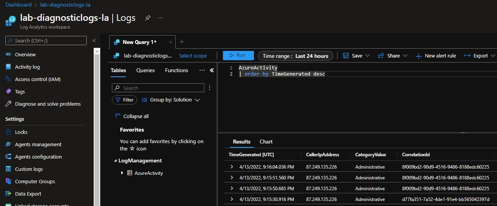


### 6. Połączenie danych za pomocą `Azure Workbooks`


* [Łączenie danych w Azure Monitor workbooks](https://github.com/microsoft/Application-Insights-Workbooks/blob/1ddc38529f498c209fb3fe21795f607d4cd232b7/Documentation/DataSources/DataSources.md#merge-data-from-different-sources)

#### 6.1 Przechodzimy do usługi `Monitor`
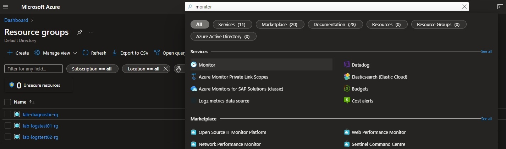

#### 6.2 Następnie `Workbooks` -> `New` i tworzymy nowy  workbook
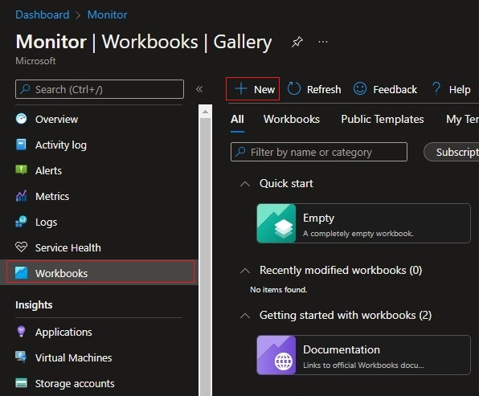

#### 6.3 Zapytanie do `Log Analytics`
Dodajemy nowe zapytanie:

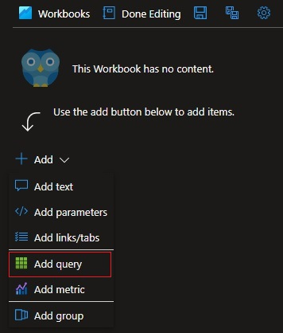

Wybieramy nasz `Log Analytics`, przedział czasowy i wklejamy poniższe zapytanie:
```kql
AzureActivity
| where ActivityStatusValue =~ "Success"
| order by TimeGenerated desc 
| distinct CorrelationId, Caller
```

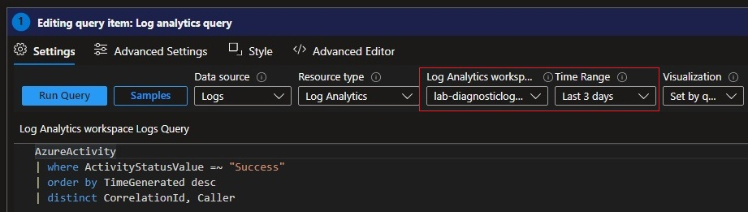

Przechodzimy do zakładki `Advanced Settings` i uzupełniamy `Step name`:

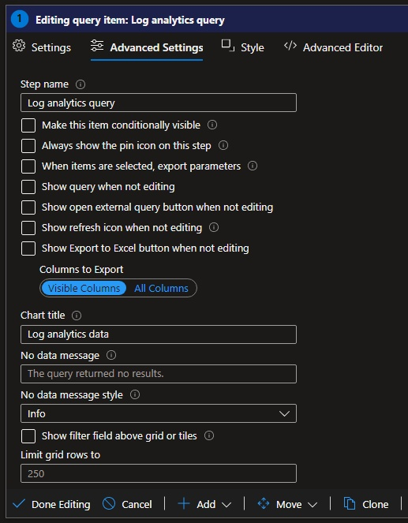

#### 6.4 Zapytanie do `Resource Graph`:
Dodajemy nowe zapytanie, tym razem jako `Data source` wybieramy `Azure Resource Graph` i ustawiamy nazwę zapytania w `Advanced Settings` -> `Step name`:
```kql
resourcechanges 
| where isnotempty(properties.changes["properties.ipAddress"].newValue) or isnotempty(properties.changes["properties.ipAddress"].previousValue)
| extend changeTime=todatetime(properties.changeAttributes.timestamp) 
| order by changeTime desc 
| project properties.changeAttributes.timestamp, properties.changeAttributes.correlationId, properties.changeType, 
newIP=properties.changes["properties.ipAddress"].newValue, 
oldIP=properties.changes["properties.ipAddress"].previousValue
```
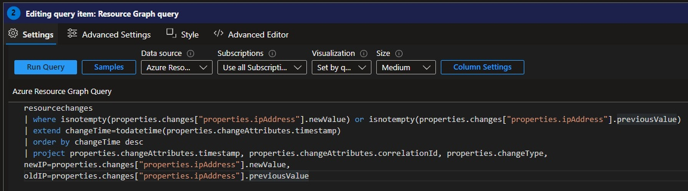

#### 6.5 Połączenie danych
Dodajemy nowe zapytanie, jako `Data source` wybieramy `Merge`, następnie wybieramy `Add Merge`:

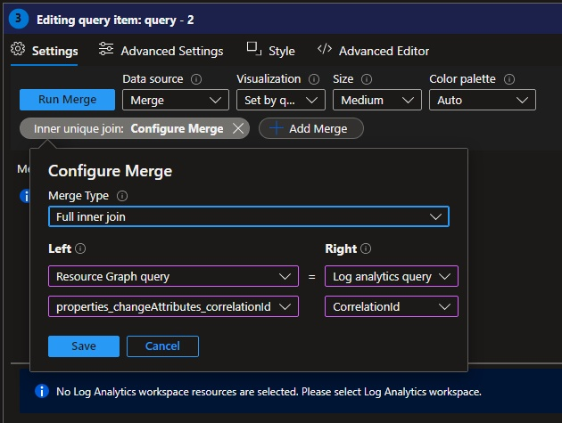

Otrzymane dane:
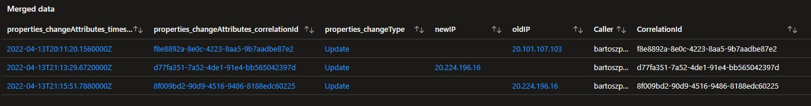


### 7. Usunięcie zasobów
```bash
az group delete --name $DIAGNOSTIC_RG --subscription $SUB_02 --yes --no-wait
az group delete --name $LOGSTEST01_RG --subscription $SUB_01 --yes --no-wait
az group delete --name $LOGSTEST02_RG --subscription $SUB_02 --yes --no-wait
```

Usunąć należy również plan skonfigurowany w [pkt. 2](#2-wysyłanie-logów-z-activity-log-do-log-analytics).


## Linki
* [Send to Log Analytics workspace](https://docs.microsoft.com/en-us/azure/azure-monitor/essentials/activity-log#send-to-log-analytics-workspace)
* [Kategorie logów - opis](https://docs.microsoft.com/en-us/azure/azure-monitor/essentials/activity-log-schema?WT.mc_id=Portal-Microsoft_Azure_Monitoring#categories)
* [What is Azure Resource Graph?](https://docs.microsoft.com/en-us/azure/governance/resource-graph/overview)
* [Quickstart: Run your first Resource Graph query using REST API](https://docs.microsoft.com/en-us/azure/governance/resource-graph/first-query-rest-api)
* [Łączenie danych w Azure Monitor workbooks](https://github.com/microsoft/Application-Insights-Workbooks/blob/1ddc38529f498c209fb3fe21795f607d4cd232b7/Documentation/DataSources/DataSources.md#merge-data-from-different-sources)
* [How to call Azure REST APIs with Postman](https://docs.microsoft.com/en-us/rest/api/azure/#how-to-call-azure-rest-apis-with-postman)


<!-- 
<details>
  <summary><b><i>Utworzone środowisko</i></b></summary>


</details>