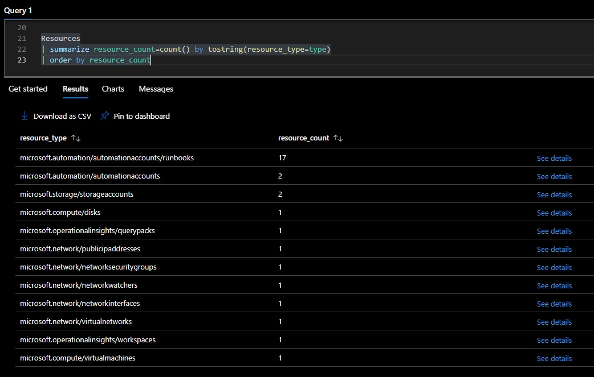
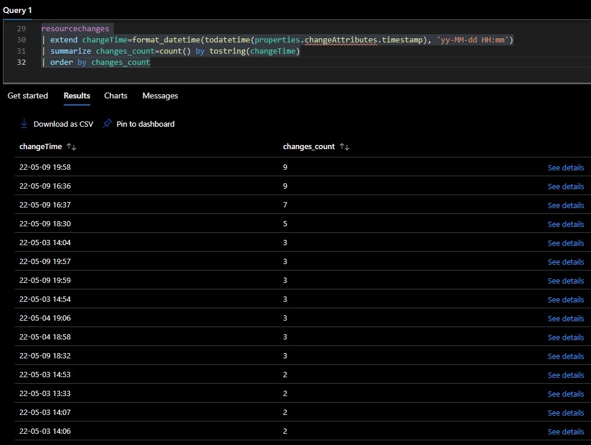
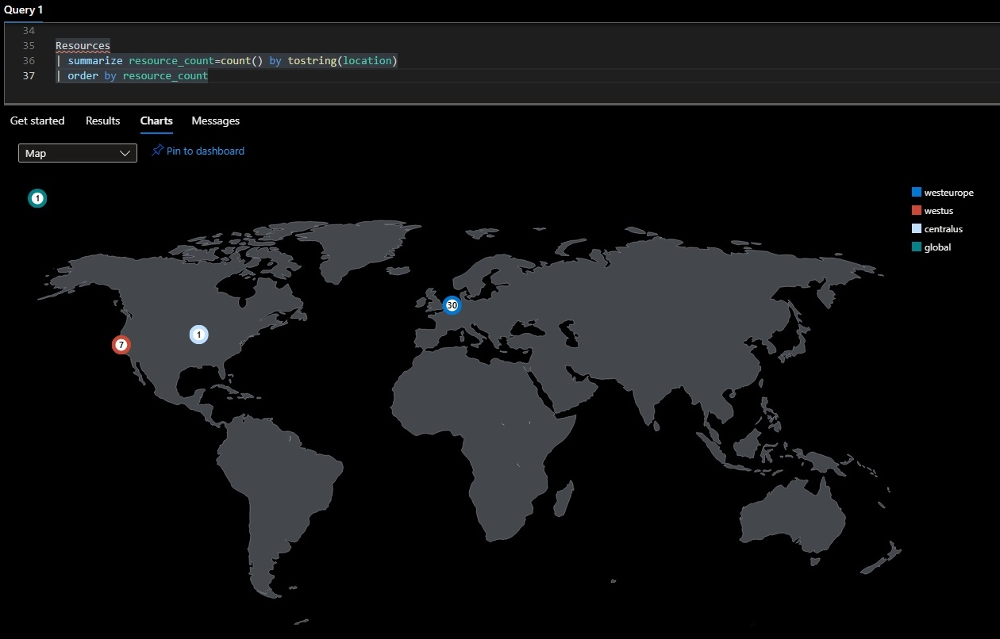
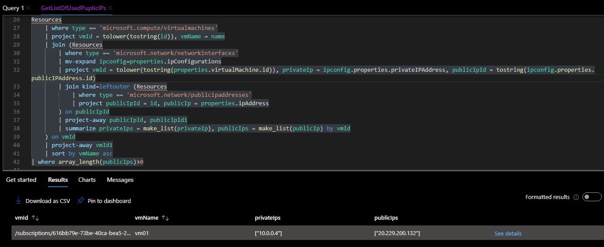

# Resource Graph

* `resources` - tabela przechowująca informacje o obecnych zasobach
* `resourcechanges` - tabela przechowująca zmiany na zasobach ([Get resource changes](https://docs.microsoft.com/en-us/azure/governance/resource-graph/how-to/get-resource-changes))

#### 1. Liczebność zasobów według danego typu
```kql
Resources
| summarize resource_count=count() by tostring(resource_type=type)
| order by resource_count
```

<details>
  <summary><b><i>Results</i></b></summary>


</details>


#### 2. Największa liczba zmian w ciągu 1 minuty
```kql
resourcechanges 
| extend changeTime=format_datetime(todatetime(properties.changeAttributes.timestamp), 'yy-MM-dd HH:mm')
| summarize changes_count=count() by tostring(changeTime)
| order by changes_count
```

<details>
  <summary><b><i>Results</i></b></summary>


</details>

#### 3. Ilośc zasobów według lokalizacji
```kql
Resources
| summarize resource_count=count() by tostring(location)
| order by resource_count
```

<details>
  <summary><b><i>Results</i></b></summary>


</details>


#### 4. Lista adresów IP używanych przez VM
* [Azure Resource Graph query to find all VMs with public IPs](https://stackoverflow.com/questions/56758465/azure-resource-graph-query-to-find-all-vms-with-public-ips)
* [Print all VM names and private IP from subnet](https://stackoverflow.com/questions/67674782/print-all-vm-names-and-private-ip-from-subnet)

```kql
Resources
    | where type =~ 'microsoft.compute/virtualmachines'
    | project vmId = tolower(tostring(id)), vmName = name
    | join (Resources
        | where type =~ 'microsoft.network/networkinterfaces'
        | mv-expand ipconfig=properties.ipConfigurations
        | project vmId = tolower(tostring(properties.virtualMachine.id)), privateIp = ipconfig.properties.privateIPAddress, publicIpId = tostring(ipconfig.properties.publicIPAddress.id)
        | join kind=leftouter (Resources
            | where type =~ 'microsoft.network/publicipaddresses'
            | project publicIpId = id, publicIp = properties.ipAddress
        ) on publicIpId
        | project-away publicIpId, publicIpId1
        | summarize privateIps = make_list(privateIp), publicIps = make_list(publicIp) by vmId
    ) on vmId
    | project-away vmId1
    | sort by vmName asc
| where array_length(publicIps)>0
```

<details>
  <summary><b><i>Results</i></b></summary>


</details>


<!-- ## Linki
* [Azure REST APIs with Postman (2021) - youtube](https://youtu.be/6b1J03fDnOg)
* [Get the List of All Azure VMs With All Their Private and Public IPs](https://mihai-albert.com/2020/10/01/get-the-list-of-all-azure-vms-with-all-their-private-and-public-ips/)
https://blog.blksthl.com/2022/02/22/list-all-changes-made-in-your-azure-environment-in-one-query-using-azure-resource-graph/

 -->

